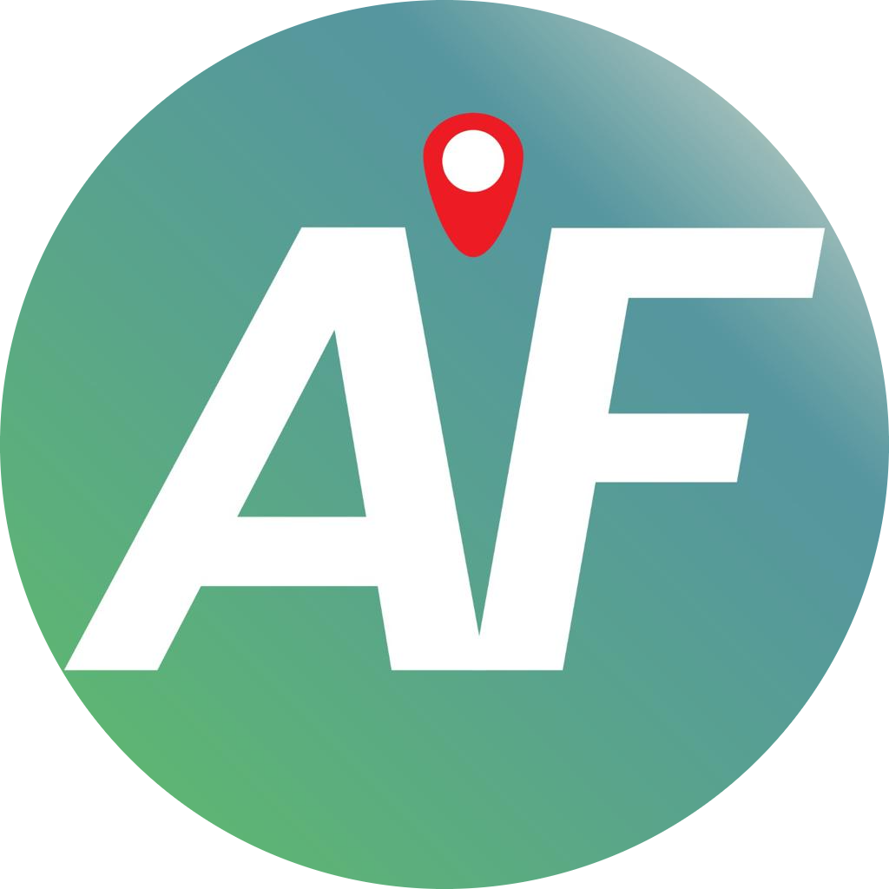

<h1>
  
  Anywhere Fitness
</h1>

A mock online community health app for Code Overflow Hackathon 2023!

> **Announcement**: We have won 3rd place for the Code Overflow Hackathon 2023! The project's final state for submission for the hackathon is at [this tag](https://github.com/dentolos19/anywhere-fitness/tree/submission).

## 🏢 Mission

**Problem Statement**: How might we leverage technology to encourage and promote healthy living?

### Team Members

- Dennise
- Jian Wei
- Yan Jun
- Alex

## 📜 License

Distributed under the MIT License. See [LICENSE](LICENSE) for more information.